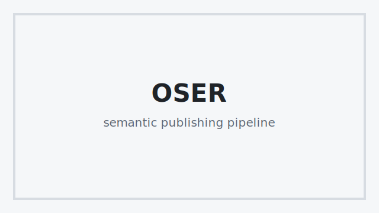

# OSER Editorial Stress Sample

This document is designed as a practical stress-test file for OSER. It is not meant to be beautiful by default. It is meant to reveal how the pipeline behaves when a real editorial document mixes headings, long paragraphs, blockquotes, figures, lists, tables, inline formatting, code, and multilingual text.

The expected pipeline is:

```text
Markdown
→ OserDocument
→ diagnostics
→ LayoutProfile
→ HTML preview
→ PDF export
→ RenderManifest
```

The document should render without crashing. Some parts are intentionally awkward so that OSER Studio can reveal layout, preview, diagnostics, or UX problems.

## Basic Prose With Inline Elements

This paragraph includes **strong emphasis**, *italic emphasis*, `inline code`, and a [link to the OSER repository](https://github.com/sigilabcodex/oser). It also includes a deliberately long sentence that should wrap naturally in the preview and in the PDF export, because editorial systems need to preserve comfortable reading rhythm even when prose is dense, uneven, and occasionally verbose.

Spanish text should also behave correctly: la tipografía, los acentos, las comillas “latinas”, los signos de apertura ¿? ¡!, y palabras como edición, publicación, maquetación, índice, corazón y filosofía deben conservarse correctamente.

> A useful editorial engine should not merely convert text into pages. It should help reveal structure, tension, rhythm, hierarchy, and the points where the designer needs to make a decision.

## Lists And Nested Structure

This section tests ordered and unordered lists.

- First unordered item.
- Second unordered item with a longer explanation that should wrap naturally across lines without becoming visually confusing.
- Third unordered item:
  - Nested point A.
  - Nested point B with **bold** and *italic* inline styles.
  - Nested point C.

1. First ordered item.
2. Second ordered item with extra text to make wrapping visible.
3. Third ordered item.

## Image / Figure Test

The following image intentionally references the existing OSER placeholder asset. If this file is copied into `stress-tests/cases/`, the relative path may need adjustment depending on where it is rendered from.



The paragraph after the figure helps evaluate vertical rhythm. Ideally the figure should not collide with surrounding text, should not overflow the page width, and should behave consistently in HTML preview and PDF output.

## Medium Table

This table should be easy for OSER to handle.

| Area | Current expectation | Possible future improvement |
| --- | --- | --- |
| Import | Markdown table becomes an OserDocument table | Detect table intent or role |
| HTML | Table renders cleanly | Add responsive table strategies |
| PDF | Table remains readable | Add compact or landscape strategies |
| Studio | Table appears in preview | Add table-specific diagnostics |

## Wide Table Stress

This table is intentionally wide. It should reveal whether the preview clips, scrolls, wraps, compresses, or overflows. The PDF may be acceptable even if the Studio preview needs improvement.

| ID | Section | English Label | Spanish Label | Intended Use | Long Description | Risk | Suggested Strategy | Notes | Status |
| --- | --- | --- | --- | --- | --- | --- | --- | --- | --- |
| T-001 | Import | Semantic Recovery | Recuperación semántica | Detect headings, tables, figures, and lists | This cell contains enough text to force wrapping in narrow columns and reveal row-height behavior. | Medium | Diagnostics | Check preview overflow | Draft |
| T-002 | Layout | Table Strategy | Estrategia de tabla | Decide how wide tables behave | Some tables should be compact, some should become landscape pages, and some should become cards in web outputs. | High | LayoutProfile option | Could become issue | Open |
| T-003 | Studio | Visual Inspection | Inspección visual | Help editors understand what happened | The GUI should show when the output is technically valid but editorially awkward. | Medium | Manifest + diagnostics | Useful for designers | Open |
| T-004 | WebBook | Reading Mode | Modo de lectura | Adapt to screens, e-ink, and monitors | A WebBook output may prefer horizontal scroll or transformed card views instead of print-like tables. | Low | ReadingProfile | Future feature | Later |

## Code Block

```ts
type RenderDecision = {
  documentPath: string;
  profilePath: string;
  outputTarget: "html" | "pdf" | "webbook";
  requiresHumanReview: boolean;
};
```

The code block should preserve indentation and monospace formatting.

## Heading Hierarchy Stress

This part intentionally introduces a suspicious heading structure.

### Jumped To H3

This heading jumps from H2 to H3. Depending on the current diagnostics mode, OSER may or may not warn about this specific context.

#### Then H4

This subsection is not necessarily invalid, but it helps test whether the document outline is visually clear.

## Returning To H2

This section returns to H2 after entering H3/H4. It may be legitimate, but in long editorial documents this kind of structure should be easy to inspect.

## Long Paragraph Stress

A long paragraph follows. It is meant to test line length, wrapping, rhythm, and page breaks. The paragraph does not contain particularly meaningful content, but it simulates the kind of dense prose that appears in essays, manuals, book chapters, academic introductions, institutional documents, and technical notes. A good rendering system should preserve readability without requiring immediate manual intervention. A good Studio interface should reveal when the result is merely acceptable versus when it needs editorial attention. This is especially important when the same document needs to become a print PDF, a web article, a WebBook, or an EPUB.

---

## Closing Notes

This file is useful for testing:

- Markdown import.
- Diagnostics.
- HTML preview.
- PDF export.
- RenderManifest output.
- LayoutProfile behavior.
- Studio document selection.
- Wide table behavior.
- Future WebBook assumptions.

The document should be safe to version as a stress-test fixture.
